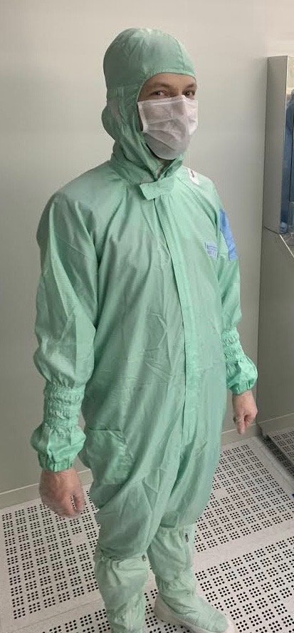
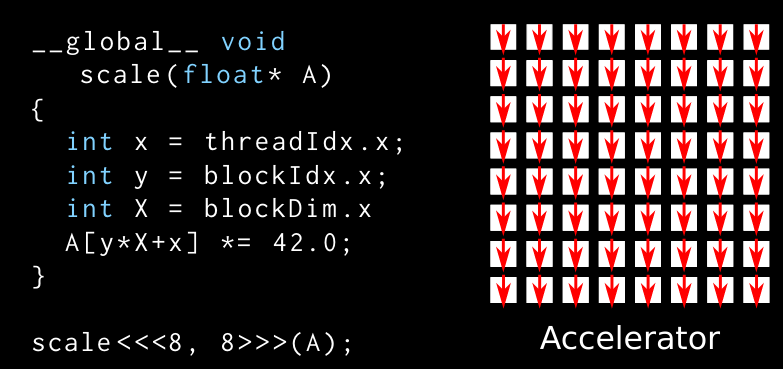
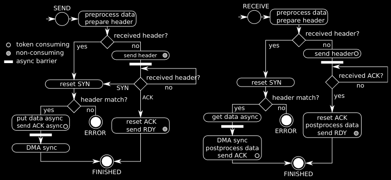
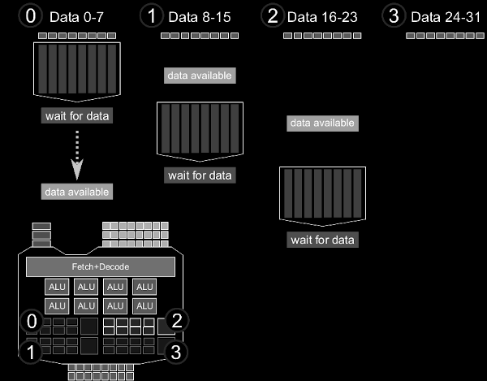

My Name is Sebastian Schaetz. My background is in computer science,
I work on software in the data and hardware manufacturing space. I'm
also experienced in making signal processing and numerical codes fast
using multi- and many-core architectures. I have fun stories about
fixing software bugs in clean-rooms.

I currently work as a Software Engineerg on some exciting hardware and software that interfaces with the real world.

Previously I worked at Butterfly Network where they make hand-held Ultrasound
devices. To get an idea about some of my work there check out one of
my blog posts on the Engineering blog there: [Ultrasound Beamforming on Mobile Devices: from Prototype to Product](https://web.archive.org/web/20220517205411/https://www.butterfly.dev/blog/ultrasound-beamforming-on-mobile-devices-from-prototype-to-product).

I have a few projects on [GitHub](https://github.com/sschaetz) including an
awesome-list where I am collecting great [hardware test resources](https://github.com/sschaetz/awesome-hardware-test)
and [Aura](https://github.com/sschaetz/aura), header-only C++ library for
accelerator development that works with Metal, OpenCL and CUDA.

I also gave a couple of talks in my time, particularly while I was working
on modern C++ and accelerators.

## The Future of Accelerator Programming in C++

From newest to oldest, in 2014 I gave a
talk at the C++ Now conference in Aspen, Colorado that gives an overview
over accelerator programming libraries (from back then).

I compare OpenCL, CUDA, C++ AMP, OpenACC, RenderScript, Thrust, Bolst, Vexcl,
Boost.Compute, ViennaCL, MTL4, NT2, Arrayfire, and how they compare in terms of
developer productivity, generality and performance. There might even be a
recording of this talk on YouTube if you look but I think the slides from
back then should suffice.
You can find them [here](CppNow2014_Future_of_Accelerator_Programming.pdf).

## Mastering the Cell Broadband Engine architecture through a Boost based parallel communication library

Another talk I gave in 2011 was about Cell-MPI, a C++ library that implements
the standardized Message Passing Interface
([MPI](https://en.wikipedia.org/wiki/Message_Passing_Interface))
on the Cell microprocessor.

The Cell was an eccentric processor that was at the heart of the Playstation 3
game console. It combined a PowerPC core with 8 custom stream processing cores
with wide vector units, limited memory connected with a high-throughput
ring-bus. I implemented a way for any 2 stream processing cores to communicate
safely which was a lot of fun. It was not the most efficient implementation but
we were able to implement most MPI message types. This talk is also somewhere
on YouTube - but I'd recommend you just check out the slides [here](BoostCon2011_Cell_MPI.pdf).

## General-Purpose Computation on Graphics Hardware

And finally I also gave a lecture with a tutorial/lab session on General-Purpose
Computation on Graphics Hardware (GPGPU) in 2010. This is a two hour talk I
prepared for graduate students with no background in GPGPU. Over the years

I've introduced a few dozens of people to GPGPU and taught them the basics.
But this talk is the most thorough and the lab assignment with solutions teach
the concepts well. I'm making the material for the course available but please
be aware that this material is quite old but I think the general concepts and
ideas still apply. Maybe the material can serve as the foundation for an updates
workshop one day.

- the [slides](gpgpu_workshop.pdf) explain the difference between CPU and GPU,
  and what makes GPUs suitable architectures for massive-parallel problems
- the [lab](gpgpu_lab.pdf) allows students to use what they are learned by
  implementing a basic numerical integration code on the GPU
- the lab comes with starting [source code](gpgpu_lab_source.tar) as a harness to implement
  the solution
- and for the numerical integration lab there is also a [solution](gpgpu_lab_solution.tar) available

