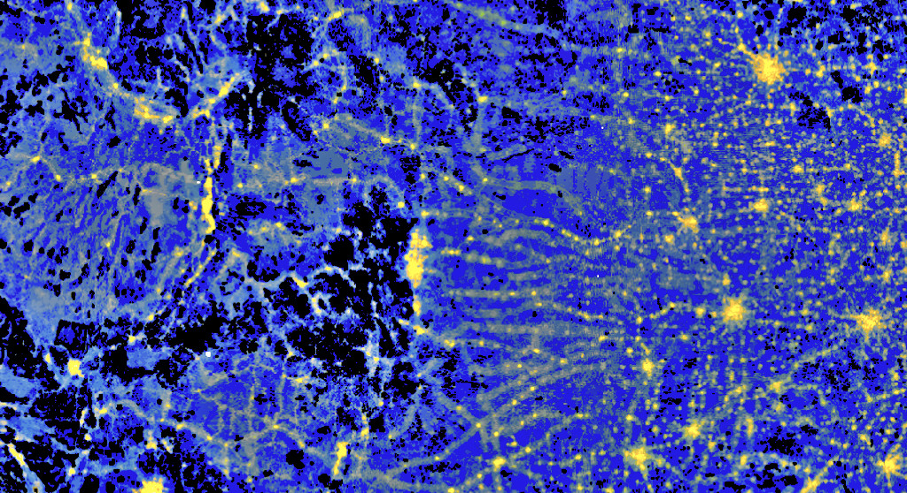

Recently I've been interested in generating "3D" acoustic soundscapes; I looked
into tools that allow creation and rendering of such immersive audio scenes.
--excerpt--

<figure>
    
    <figcaption><em>Excerpt of the impact of anthropogenic activity across the contiguous US on sound pressure levels</em> by <a href="https://www.nps.gov/orgs/1050/index.htm">National Park Service Natural Sounds and Night Skies Division</a></figcaption>
</figure>

First and foremost I looked into what tools exist in this space. Here is an incomplete list:

- [3dti AudioTookit](https://github.com/3DTune-In/3dti_AudioToolkit) "a standard C++ library for audio spatialisation and simulation using headphones". This one stands out because it is accompanied by a very comprehensive [publication](https://journals.plos.org/plosone/article/file?id=10.1371/journal.pone.0211899&type=printable) [^0] that not only describes the technical background of 3D audio spatialization but also lists a number of other tools that do similar things. 3dti works by simulating sound and considering head-related transfer function ([HRTF](https://en.wikipedia.org/wiki/Head-related_transfer_function)), a function that that describes how ears reveive sounds from a point in space. Some of the tools and libraries mentioned below come from the publication about the 3dti AudioToolkit.
- [The Anaglyph Binaural Audio Engine](https://www.aes.org/e-lib/browse.cfm?elib=19544) "is a VST audio plugin for binaural spatialization".
- [CSound](https://csound.com/) is a sound and music computing system that comes with facilities for spatialization using HRTFs and realtime rendering.
- [earplug](https://github.com/pd-externals/earplug) is a realtime binaural filter that allows spatialiation of sound in realtime.
- [Facebook 360 Spatial Workstation](https://facebookincubator.github.io/facebook-360-spatial-workstation/#) "is a software suite for designing spatial audio for 360 video and cinematic VR" that Facebook is ending support for on 2022-05-16 "due to the abundance of quality tools for creating 3D immersive, spatial audio".
- [hrir](http://arts.u-aizu.ac.jp/research/pd-hrir) interpolates head related impulse reponses at different distances to locate sources at different distances from the listener.
- [Icram Spat](https://forum.ircam.fr/projects/detail/spat/) "is a software suite for spatialization of sound signals in real-time intended for musical creation, postproduction, and live performances". 
- [IEM Plug-in Suite](https://plugins.iem.at/) "is a free and Open-Source audio plugin suite including Ambisonic plug-ins", created with the JUICE framework.
- [OpenAL Soft](https://github.com/kcat/openal-soft) "is a LGPL-licensed, cross-platform, software implementation of the [OpenAL 3D audio API](https://openal.org/)". Development is very active and the OpenAL API it implements is used in numerous  [games](https://en.wikipedia.org/wiki/OpenAL#Games).
- [pyrommacoustics](https://github.com/LCAV/pyroomacoustics) "is a software package aimed at the rapid development and testing of audio array processing algorithms". It consists of a Python API, a fast C++ implementation for efficient generation of room impulse responses and propagation simulation as well as reference implementations for popular algorithms (STFT, beamforming, direction finding, adaptive filtering, source separation, denoising).
- [Resonance Audio](https://github.com/resonance-audio), open source SDKs, tools, and source code for "high fidelity spatial audio at scale" (the "at scale" appendage is likely a remnant from the Google where the project started). There is a SDK for the Unity game engine, a SDK for the web among other things but the core is the [Resonance Audio C++ library](https://github.com/resonance-audio/resonance-audio). It is all about creating experiences with VR googles where realistic 3D sound can enhance the level of immersion.
- [slab3d](http://slab3d.sourceforge.net/) is a real-time virtual environment rendering system originally developed in the Spatial Auditory Displays Lab at NASA Ames Research Center. It seem fairly outdated (last release 2018-08-23 as of this writing).
- [SoundScape Renderer](https://github.com/SoundScapeRenderer/ssr) is a cross-platform software framework for real-time spatial audio rendering. Development seems moderately active; they have [extensive documentation](https://ssr.readthedocs.io/en/0.5.0/) and rely on an XML-based Audio Scene Description Format [^1].
- [Spatial_Audio_Framework](https://github.com/leomccormack/Spatial_Audio_Framework) is "an open-source and cross-platform framework for developing spatial audio related algorithms and software in C/C++". The framework is under active development and supports HRIR processing, room simulation as well as augmented-reality devices. The [SPARTA](https://github.com/leomccormack/SPARTA) collection of VST audio plug-ins for spatial audio production is based on the framework.
- [Spatial Sound in Unity](https://docs.microsoft.com/en-us/windows/mixed-reality/develop/unity/spatial-sound-in-unity) and open source [plugins](https://github.com/microsoft/spatialaudio-unity) for Unity 3D (Windows and Android) with spatial audio DSP processing implementations.
- [Steam Audio SDK](https://valvesoftware.github.io/steam-audio/) is a 3D sound API (through HRTF-based binaural rendering) for video games. There is a Unity, Unreal, FMOD Studio plugin and a [C API](https://valvesoftware.github.io/steam-audio/doc/capi/index.html).
- [VRWorks Audio](https://developer.nvidia.com/vrworks/vrworks-audio) is a GPU accelerated audio plugin fo rthe Unreal Engine that uses GPU accelerated path-tracing to render 3D soundscapes.

It is clear that quite a lot of work has gone into the research and development of spatial audio. WIth the growing popularity of virtual and augmented reality, spatial audio is more important than ever. Spatial audio greatly amplifies the degree of immersiveness. But academic interest exists long before AR and VR came along due to the importance of binaurality in speech intelligibility.

[^0]: Cuevas-Rodríguez, María, et al. "3D Tune-In Toolkit: An open-source library for real-time binaural spatialisation." PloS one 14.3 (2019): e0211899.
[^1]: Geier, Matthias, et al. "ASDF: Ein XML format zur beschreibung von virtuellen 3D-audioszenen." 34. Jahrestagung der Deutschen Gesellschaft für Akustik (2008): 10-13.

