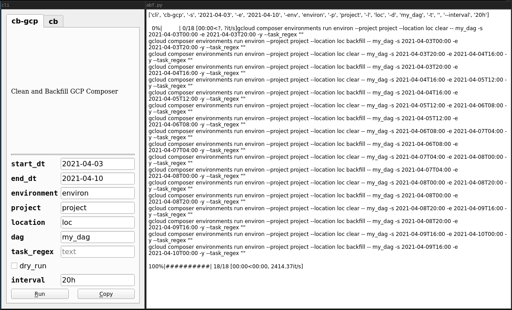

At a high level backfilling in Airflow is a mechanism that allows (re-)execution
of Airflow DAG instances for a specific time interval. It is a useful but inherently
fragile and brittle process in Airflow. --excerpt-- Common use-cases for backfilling
data are:

1. the data pipeline code changed (a bugfix for example) and the output data should be
   refreshed using the new pipeline code
2. an external service (an SFTP for example) was offline for a period of time and a
   number of DAG instances did not succeed
3. in a development environment the pipeline code should be tested to verify it
   processed input data correctly and produces expected output data

A common gotcha with [backfill](https://airflow.apache.org/docs/apache-airflow/stable/dag-run.html#backfill)
in Airflow is that the scheduler can not very well handle backfill jobs that trigger
dozens to hundreds of DAG instances (tested in pre 2.0 Airflow versions). It is unclear to me
exactly why this happens but I found that if a large backfill job is split up into multiple smaller
ones, Airflow can handle that just fine.

<figure>
    
    <figcaption>Image by <a href="https://flickr.com/photos/nearnearfuture/14370315406/in/album-72157644706240328/">
régine debatty</a></figcaption>
</figure>

I thus wrote a simple tool: [abf](https://github.com/sschaetz/abf) - a CLI tool that issue backfill
commands to Airflow in small portions. One specifies the date-range to backfill over:

`-start_dt 2021-02-04 -end_dt 2021-03-05` and the `--interval 6h` to split the timespan in (6 hours)
in this example and the tool will issue backfill commands for 6 hour portions one after another
for the timespan specified.

The tool can also work with [Google Cloud Composer](https://cloud.google.com/composer) and if
[quick](https://github.com/szsdk/quick) is installed there is even a simple UI:

<figure>
    
    <figcaption><a href="https://github.com/sschaetz/abf">Airflow Backfill Tool GUI</a></figcaption>
</figure>

Lastly, while slightly overkill for a tool like this, I took some time to set up a GitHub actions
based [automated lint and test step](https://github.com/sschaetz/abf/actions) using
the Python tool [fourmat](https://github.com/4Catalyzer/fourmat) that combines Flake8 with Black and
isort.

There is currently no pypi package for it so to install you have to clone the repo.
I might go through that exercise next.
