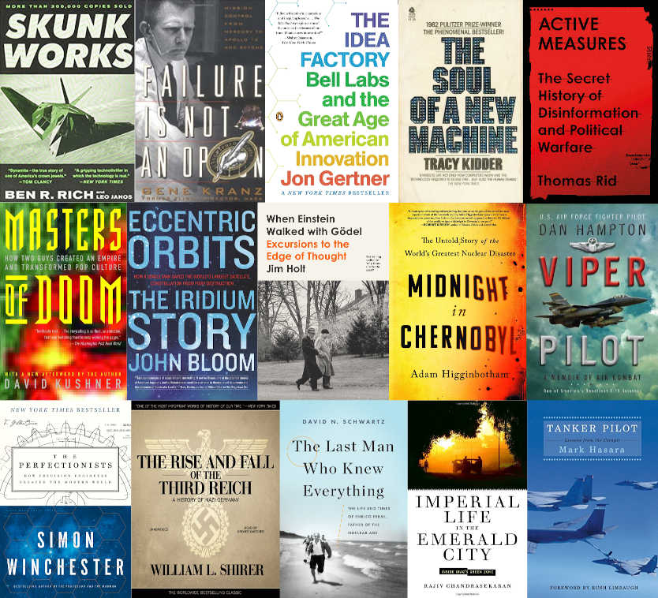

Over the last 3 years I read and listened to a number of books. Some of them stood out
to me for one reason or another. I am listing those books here.

The list serves the purpose of reminding myself of the interesting tidbits in the book,
why I enjoyed it and why I might want to read it/listen to it again. I tried to categorize
them but I don't think that is particularly helpful - it is also hard. The box are all
fiction books and a mix of history, technology, science, aviation, memoir and biography.

--excerpt--

**Skunk Works**: _A Personal Memoir of My Years of Lockheed_ by Ben R. Rich [^skunkworks]
is the first non-fiction technology history book I recommend to anybody who
has not read it. The book cover features an F-117 Nighthawk - but I like the
book most for its discussion of the Lockheed SR-71 Blackbird development
process and associated technologies. It ties engineering challenges and
leadership, innovation culture, Russian missiles in with an absolutely unique
aircraft.

**Failure Is Not an Option**: _Mission Control from Mercury to Apollo 13 and
Beyond_ by Gene Kranz is the autobiography by the NASA Chief Flight Director
working on Apollo 11 and on saving the crew of Apollo 13. One of the highlights
in the book for me is the speech he gives after the Apollo 1 disaster:

<blockquote>From this day forward, Flight Control will be known by two words:
"Tough and Competent." Tough means we are forever accountable for what we
do or what we fail to do. We will never again compromise our responsibilities.
Every time we walk into Mission Control we will know what we stand for.
Competent means we will never take anything for granted. We will never be found
short in our knowledge and in our skills. Mission Control will be perfect.
</blockquote>

With this speech Kranz attempts to initiate a shift in attitude for the entire
Apollo project. He warns everybody to take responsibility and to do a better job.
Quite inspiring.

I was interested in **The Idea Factory**: _Bell Labs and the Great Age of
American Innovation_ by Jon Gertner because I wanted to understand what
environments foster innovation - Bell Lab being a place and time where an
incredible amount of scientific and engineering breakthroughs occurred. It
is credited with development of radio astronomy, the transistor, the laser,
the photovoltaic cell, CCD, information theory, Unix, C, C++, etc. It is
written not like a corporate history but more like an electrifying novel.

<figure>
    
</figure>

To me **The Dream Machine** by M. Mitchell Waldrop is closely related to
the Bell Labs book. It does not describe a time and place that oozed
innovation but a mind - that of J.C.R. Licklider a visionary of the
human-computer symbiosis and the networked world. Learning about the
the history of batch and real-time processing that cumulates in a
description of the mother of all demos and observations about how the
audience reacted was fantastic.

Very related is the book **The Soul of a New Machine** by Tracy Kidder.
It chronicles the design of a new computer system in in the late 70s.
The story about how engineers who don't know better or don't know to say
"no" because they are fresh out of school work day and night on a risky
project that is the companies only hope to be competitive in the market
sounds very familiar to me and I identified many similarities to my
own experience during the early days in my career.

Similarly exciting is the book **Masters of Doom**: _How Two Guys Created
an Empire and Transformed Pop Culture_ by David Kushner. It describes
the story of the "Two Johns", how they met, founded their own company
and created two incredibly successful video games Commander Keen and
Wolfenstein 3D. Reading about how surprised they were about how
successful the first shareware versions of their game were is truly
inspiring.

**Eccentric Orbits**: _The Iridium Story_ by [[insert name]] tells the story
of the rollercoaster story of the Iridium satellite phone network. It's a wild
tale that combines technology, business, governments and markets and how they
interact - on a global scale. It's also a story about a lot of money being
spent on an technology that fails to meet its ambitious market goals but
ultimately does a lot of good.

 

<figure>
    
</figure>

 

**Midnight in Chernobyl** by Adam Higginbotham is the riveting story of the
Chernobyl Nuclear Power Plant accident. The book has it all: a depiction
of the state of the Soviet Union and its daughter-states at the time
of design and construction of the nuclear power plant in question. One thing
that stood out to me was that according the author, many power-plant parts
once delivered from various factories had to be re-worked because they
did not meet the specification. The author suggests that in the planned
economy of the Soviet-Block states did not reward quality but quantity
and timeliness. Also interesting is the re-telling of how helicopter crews
poured material over the open reactor to seal and shield it. This effort
is astonishing.

Going a bit further back in history, another fascinating book I enjoyed was
**The Rise and Fall of the Third Reich**: _A History of Nazi Germany_ by
William L. Shirer. It is a comprehensive history from Hitlers early days
all the way to the end of WW2. I learned about the time before Hitler came
to power when he was imprisoned but was able to plot and scheme as well
as communicate with his allies. I also enjoyed the author's more personal
remarks: he lived in Germany during that time as a journalist and sometimes
interjects that he saw such and such arrive on that day at the train station
which makes this journalistic account feel authentic.

**Imperial Life in the Emerald City**: _Inside Iraq's Green Zone_ is also
by Rajiv Chandrasekaran.  a book that talks about a despot or rather the
aftermath of what happens when a despot is dethroned and a country needs to
be rebuilt. The book was made into a movie as well - both are fairly good
but the book is truly great. The book talks about the time Paul Bremer was
effectively the CEO of Iraq - the author refers to him as the "Viceroy", a
phrase that has stuck with me as it is such an imperial and monarchical
term.

**Active Measures**: _The Secret History of Disinformation and Political
Warfare_ by Thomas Rid is a fascinating history of disinformation campaigns
before, during and after the cold war. The author chronicles different
techniques used over the years by various intelligence agencies (CIA, MfS,
BND, KGB, FSB) that range from activities like making companies believe orders
for industrial equipment are cancelled all the way to planting the idea that
HIV/AIDS was part of a biological weapons research project in the US. I enjoyed
the philosophical angle where active measure actors justify their activities
with Lenin who wrote "The more powerful enemy can be vanquished only by exerting
the utmost effort, and by the most thorough, careful, attentive, skillful and
obligatory use of any, even the smallest, rift between the enemies [...]".

Two bocks I did not think I would enjoy as much as I did are
**Viper Pilot**: _A Memoir of Air Combat_ by Dan Hampton a book that
describes in a very descriptive and "cool" (think Top Gun) way a situation
of landing a 5-ship of fighters in a sand-storm during the war in Iraq.
The second book I enjoyed more for its honest description of team-work and
operations: **Tanker Pilot**: _Lessons from the Cockpit_ by Mark Hasara.

One of the most engaging popular technology books I have read in the last
couple of years is  **The Perfectionists**: _How Precision Engineers Created
the Modern World_ by Simon Winchester which talks about the rise of manufacturing
and precision in engineering and manufacturing - topics I am very interested in
not least because of my job in an operations & manufacturing team. Precision
in manufacturing is such a key ingredient and the author explains its importance
well: to make a large number of a thing, every component that makes up the thing
must be manufactured with such accuracy that there are no exceptions during
assembly. Beyond that the author tells fascinating stories about how the first
man-made satellite Sputnik inspired the creation of the GPS.

**When Einstein Walked with Gödel**: _Excursions to the Edge of Thought_ by Jim Holt
is a collection of thought-provoking essays about ideas in science, higher mathematics
and philosophy such as the theory of infinity, quantum mechanics, computability and
on the philosophical side the theory of truth. The author chose these ideas based
on his perception of their beauty. I had to do some research on one of the essays about
Charles Babbage's proposed mechanical general-purpose computer and Ada Lovelace's
contributions. It seems to be a somewhat controversial topic - I like Stephen Wolfram's
take on the topic who suggested that Lovelace's contribution was to distill from "a
clear exposition of the abstract operation of the machine—something which Babbage
never did."

And finally - a biography of Enrico Fermi: **The Last Man Who Knew Everything**:
_The Life and Times of Enrico Fermi, Father of the Nuclear Age_ by David N. Schwartz talks
about the extraordinary life of this exceptional scientists. From using the fact that
he won the Nobel as an opportunity to flee fascist Italy to anecdotes about Fermi always
making a point to stop experiments and work for lunch. Reminds me of scientist I worked
with in the past.

