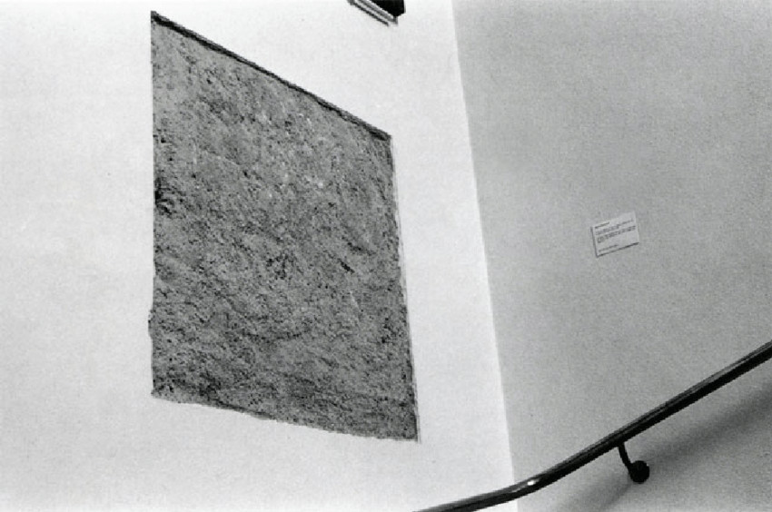
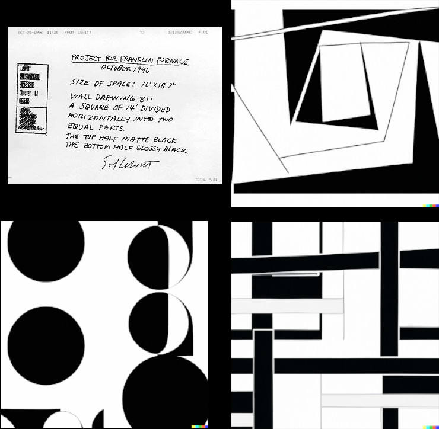
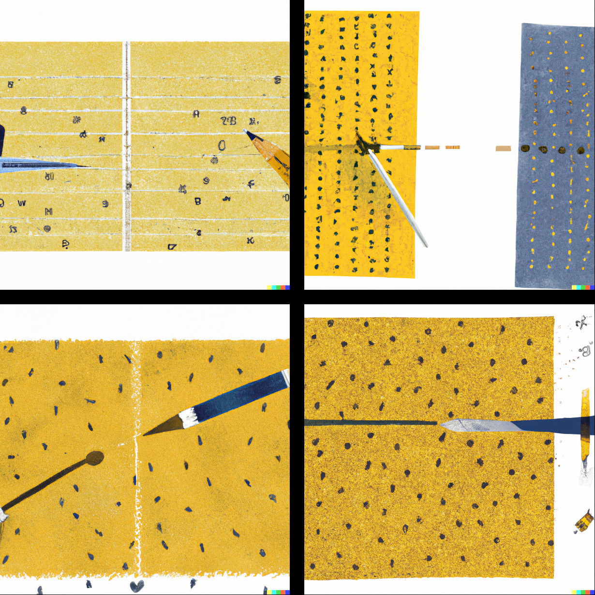
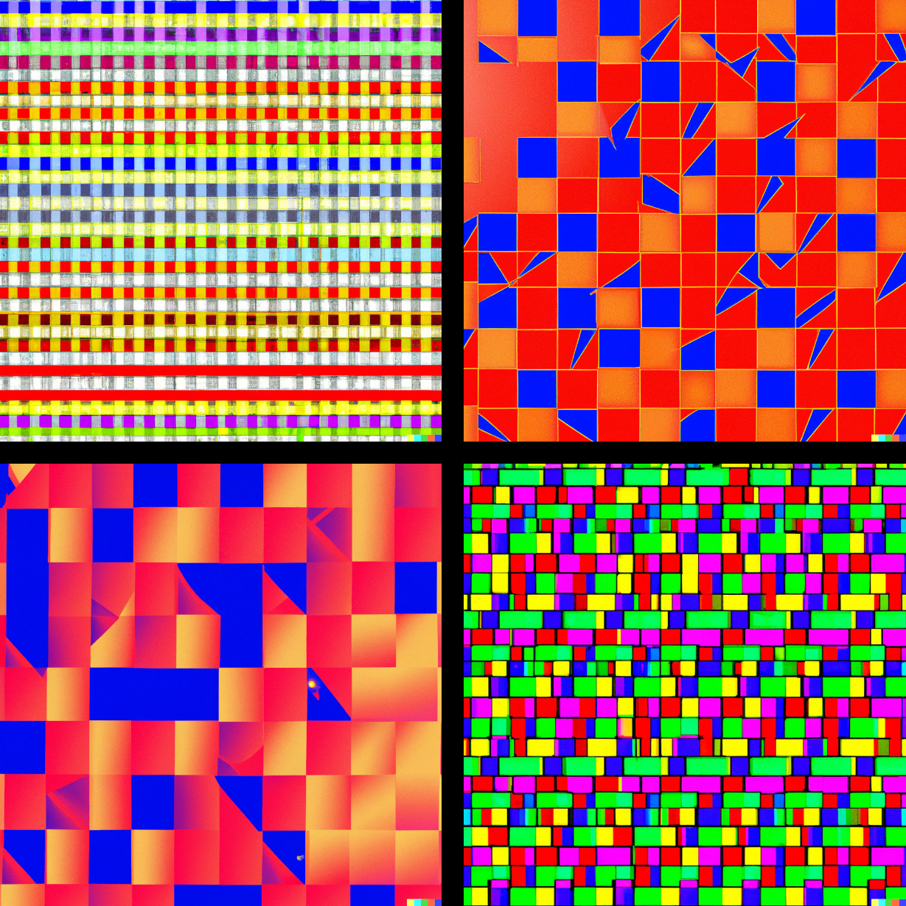
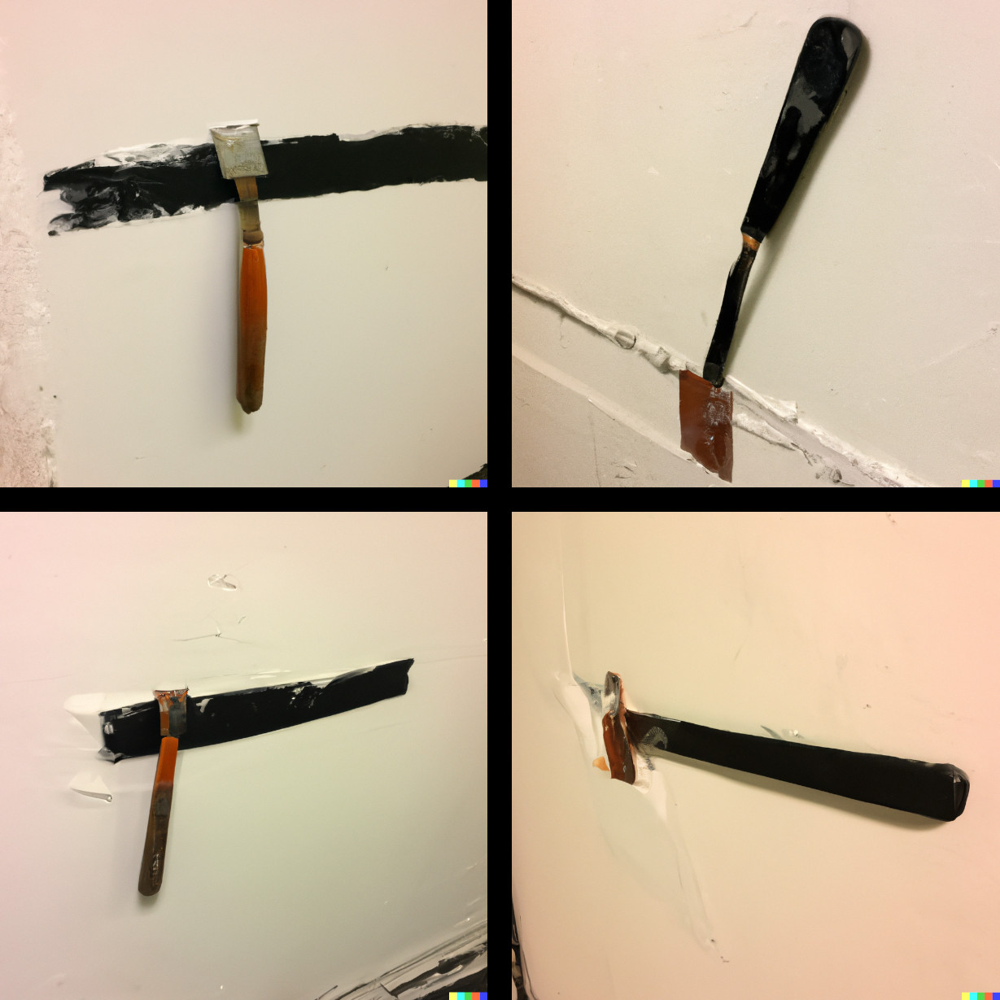

The most significant art exhibit I ever attended to date was the 2013 remake of a 1969 
art show in Bern, Switzerland called &quot;Live In Your Head: When Attitudes Become Form&quot; where
Harald Szeemann &quot;wanted to show everything that we had not yet seen, everything that came 
after 'Pop Art' and 'Minimal Art'&quot; (Grégoire Muller, exhibition catalog). 

--excerpt--

There are many memorable pieces of art from that show but one I particularly enjoyed
was Lawrence Weiner's &quot;A 36&quot; by 36&quot; removal to the lathing or support wall of plaster or wallboard from a wall, 1968&quot; where the title is the art-work: a description or an instruction of what to do
to create the piece of art.

<figure>
    
    <figcaption>Lawrence Weiner, A 36&quot; x 36&quot; removal to the lathing or support wall of plaster or wallboard from a wall, 1968</figcaption>
</figure>

The fact that the idea or the concept for a piece of art takes precedence over technique and material is in my opinion a radical change in the understanding of art. Today I can still appreciate painters and sculptors of skill. But the pure execution and craftsmanship, fades a bit in the background. Concept, idea, message, aesthetics are much more interesting.

Sol LeWitt's definition of conceptual art [^0] summarizes this in a fitting way: 

<blockquote>
In conceptual art the idea or concept is the most important aspect of the work. When an artist uses a conceptual form of art, it means that all of the planning and decisions are made beforehand and the execution is a perfunctory affair. The idea becomes a machine that makes the art. 
</blockquote> 

If the idea becomes the machine that makes the art, the entity that does the work turns into a machine operator. Or maybe even better: when translating this into the world of computer science, the conceptual art is the program that gets executed by some machine or engine and the whole thing is running on some compute substrate. The output is an instantiation of the result of the program, but there are many different instantiations. 

If the artist's only connection to the instantiation of a piece of art is their idea, and if the individual artistic expression fades into the background, one fun and simple idea comes to mind: could the engine that "executes the artist's idea" be an actual machine like artificial intelligence? Let's see what happens if we feed the prompts and descriptions by conceptual artists into <a href="https://openai.com/dall-e-2/">DALL·E 2</a>.

<figure>
    
    <figcaption>Top left: instructions faxed by Sol LeWitt to Franklin Furnace for wall drawing #811 and three executions by DALL·E 2 (top right and bottom).
    </figcaption>
</figure>

I'm not a fan of this -- it has Avant-Garde vibes to it but circles, really? Did not expect circles. Let's try again:

<blockquote>
On a wall surface, any continuous stretch of wall, using a hard pencil, place fifty points at random. The points should be evenly distributed over the area of the wall. All of the points should be connected by straight lines.
</blockquote>

These are instructions by Sol LeWitt for wall drawing #118.

<figure>
    
    <figcaption>Four executions of Sol LeWitt's wall drawing #118 by DALL·E 2.
    </figcaption>
</figure>

This seems to mix Klim's gold color into a composition that did not follow the instructions at all, or maybe not precisely enough. The images are interesting but far from what the instructions describe. Rather than following the instructions, the AI seems to create a depiction of what it would look like to execute the instructions. When a human follows the instructions, the results look <a href="https://bl.ocks.org/eesur/fa54ecebcb9106937a959c3c6242dc07">very</a> <a href="http://www.ericdoeringer.com/ConArtRec/LeWitt/LeWitt-WD118.html">very</a> <a href="https://indexhibit.anthonywarnick.com/index.php/project/wall-drawing-118-after-sol-lewitt/">different</a>.

Let's let DALL·E 2 try another one -- this one can look very delicate and I find it very beautiful.

<blockquote>
Straight lines approximately one inch long, drawn at random, within a square using four directions of time, each a different color: 1) Yellow / vertical  2) Black / horizontal 3) Red / diagonal, left to right 4) Blue / diagonal, right to left and all combinations of these lines and colors on a 4 by 4 pattern of squares.
</blockquote>

<figure>
    
    <figcaption>Four executions of Sol LeWitt's drawing &quot;Straight lines, approximately one inch long, drawn at random, within a square using four directions of line, each a different color&quot; by DALL·E 2.
    </figcaption>
</figure>

I find these aesthetically pleasing. Note that the two red-tones are variants of each other. Let's look at one 
more set of images -- variants of Lawrence Weiner's square, one of my favorite pieces of art. We tell DALL·E 2 to create 

<blockquote>
A 36&quot; x 36&quot; removal to the lathing or support wall of plaster or wallboard from a wall.
</blockquote>

<figure>
    
    <figcaption>Four executions of &quot;A 36&quot; x 36&quot; removal to the lathing or support wall of plaster or wallboard from a wall&quot; by DALL·E 2.
    </figcaption>
</figure>

Now these variants of one specific output are pretty cool. We see a tool of some sort that repairs, destroys or changes a wall by chiseling, carving or scraping. It could be either a painting or a photograph.

In closing it should be noted that using Sol LeWitt's text prompts as input to an algorithm or as an algorithm description is not a new idea. Richard Lapham for example created a [Sol LeWitt Generator](
https://www.richardlapham.com/itp/2017/11/14/sol-lewitt-generator) in 2017 and the [solving-sol](https://github.com/wholepixel/solving-sol) project, an "open project to implement Sol LeWitt's instructions in JavaScript".

It's a bit like the tradeoff between conventional and machine learning solutions for particular problems. The machine learning solution going in has many more degrees of freedom, and properly trained can be quite powerful.
The conventional approach will do the same thing over and over and is often limited in what it can do. The fast number of degrees of freedom of DALL·E 2 could almost be confused with creativity.

[^0]: Sol LeWitt &quot;Paragraphs on Conceptual Art&quot; Artforum, June 1967.

