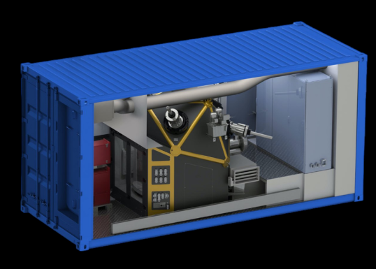

I never learned about containers. The OS-level virtualization kind. In this article I'm
documenting my journey of trying to understand what it is all about and hopefully
getting excited about virtualization.

--excerpt--

I think the two main reasons why I never learned containers are:

1. When containers were introduced I wrote [software](https://github.com/sschaetz/aura) that
heavily relied on hardware - in particular graphics processing units (GPUs); I worked
on software that needed to talk to hardware, namely a
[hand-held Ultrasound machine](https://web.archive.org/web/20171101015903/https://www.butterflynetwork.com/)
so I never dove deep on the topic of containers. [^0]

2. Furthermore the metaphor never made 100% sense to me - probably because a lot of documentation
use imagery of shipping containers. Shipping containers store and transport materials and products
in a worldwide transport system. What does that have to do with
[virtualization]((https://en.wikipedia.org/wiki/OS-level_virtualization))? Virtualization containers
are data processing blobs: you can send information into them and you can get information back out.

I'm thinking a containerized factory would be a more accurate analogy.

<figure>
    
    <figcaption><em>A factory in a box</em></figcaption>
</figure>

In reality though I think containment is the key - applications running inside are enclosed and can't cause trouble.
And they come with everything needed to run - all dependencies and packages. This makes containers useful
a number of phases during the life of software.

1. development - containers help developers set up development environments and use a well defined set of dependencies;
   think: compiler, runtime environment, third party libraries
2. continuous integration and delivery - the same containers developers use while designing the software product
   can be used for continuous integration as well as delivery; in the case of a software-as-a-service product,
   containers can even act as the runtime the product runs in
3. sustaining - with everything bottled up in a container, bringing back a development environment for bug and security
   fixes long after everybody has moved on to the next product is a clear advantage

## Getting to know Containers

So let's start. Instead of Docker I like to try podman. It is appealing due to its ability to run without root by default, daemon-less operation and support for Kubernetes. Install instructions for podman can be found [here](https://podman.io/getting-started/installation).

So let's get started:

```bash
# Find an official Ubuntu image
podman search ubuntu --filter=is-official

# Find all the available tags
podman search docker.io/library/ubuntu --list-tags

> NAME                      TAG
> [...]
> docker.io/library/ubuntu  20.04
> docker.io/library/ubuntu  20.10

# Pull the LTS image
podman pull docker.io/library/ubuntu:20.04
> Trying to pull docker.io/library/ubuntu:20.04...
> Getting image source signatures
> Copying blob 7b1a6ab2e44d done
> Copying config ba6acccedd done
> Writing manifest to image destination
> Storing signatures
> ba6acccedd2923aee4c2acc6a23780b14ed4b8a5fa4e14e252a23b846df9b6c1

# Let's see if it worked:
podman image list
> REPOSITORY                TAG         IMAGE ID      CREATED      SIZE
> docker.io/library/ubuntu  20.04       ba6acccedd29  6 weeks ago  75.2 MB
```

Success! Now let's see what we can do. Let's run our image and interact with it:

```bash
$ podman run -ti ba6acccedd29 /bin/bash
root@9d1b52619d3e:/$ cat /etc/issue
> Ubuntu 20.04.3 LTS \n \l
```

Typing `exit` would exit the session and shut down the container. But we can restart it
and it keeps its state:

```bash
root@9d1b52619d3e:/# exit
> exit

# List all containers
podman ps -a
> CONTAINER ID  IMAGE   COMMAND     CREATED        STATUS  NAMES
> 9d1b52619d3e  ...     /bin/bash   4 minutes ago  Exited  reverent_ishizaka

# Start the container again
podman start reverent_ishizaka
> reverent_ishizaka

# And attach to it and look at the history
podman attach -l
root@9d1b52619d3e:/$ history
>    1  cat /etc/issue
>    2  history

# We see the cat command from the previous run.
```

Great, now let's put this thing to use.

## Containers for Development

We will build our own image that has all the packages we need to
build [simi](https://github.com/sschaetz/simiolus)
my Audio+UI experimentation tool. Here is the container file (content of
Containerfile.simple):

```docker
# This is Ubuntu 2023.04 amd64

ARG H=7cc0576c7c0ec2384de5cbf245f41567e922aab1b075f3e8ad565f508032df17
FROM docker.io/library/ubuntu@sha256:${H}

ENV DEBIAN_FRONTEND="noninteractive" TZ="Europe/London"

# Install everything we need to build simolius
RUN apt-get update && apt-get install -y \
  cmake \
  gcc \
  g++ \
  libjack-jackd2-dev \
  libglfw3-dev \
  libfftw3-dev

```

Let's build it:

```bash
podman build -t ubuntu20.04-simiolus-build -f Containerfile.simple .
```

And now let's compile `simi`. We assume `simi` is stored in `/home/sschaetz/dev/simiolus`
and we want to share this directory with the container under `/tmp/simiolus`. We
then want to run a set of commands: change directory, run cmake and call make to compile:

```bash
podman run -ti -v \
  /home/sschaetz/dev/simiolus:/tmp/simiolus \
  ubuntu20.04-simiolus-build \
  /bin/bash -c "cd /tmp/simiolus/build; cmake ..; make -j4"
```

Et voilà! `simi` is built and ready to be used. Note that I had to link
portaudio statically which makes sense. Ship it!


<figure>
    
    <figcaption><em>Maersk container ship lowpoly</em> by <a href="https://sketchfab.com/IgorYerm">Igor Yerm</a></figcaption>
</figure>

## Containers for Continuous Integration

To add this to a continuous integration system we modify the container
file slightly - we change the first `FROM` line to:

```docker
FROM docker.io/library/ubuntu@sha256:${H} AS env
```

effectively creating a first stage of the container image called `env`. We then proceed to add a second stage called `ci-build` which is a GitHub
Action specific stage:

```docker
FROM env AS ci-build

# Copy all the files
COPY ./ /github/workspace
WORKDIR /github/workspace

# Compile
RUN mkdir -p build
WORKDIR /github/workspace/build
RUN cmake ..
RUN make -j
```

We copy the content of the repository, run `cmake` and compile. We are satisfied with only testing the compilation step for now. To run this whenever we push a commit or open a pull request we create a file `.github/workflows/build.yml` in our GitHub repository with the following content:

```yaml
name: C++ CI

on: [push, pull_request]

jobs:
  build-docker:
    runs-on: ubuntu-20.04
    steps:
    - name: Checkout repository and submodules
      uses: actions/checkout@v2
      with:
        submodules: recursive
    - name: Compile in container
      run: |
        docker build --target=ci-build \
        --tag simi:build \
        -f Containerfile.simple .
```

This is likely not the best way to do this - we add the compile step with a `build` command. Also note that GitHub does not support podman out of the box but since Docker and podman are compatible with each other this
works just fine.

It took me a while to figure out that I was missing the `submodules recursive` line in the checkout step - I was missing a lot of files but could not figure out why. Oh well.


## Appendix

When pulling the Ubuntu image the first time we notice something interesting: the image was create 6 weeks ago.

That's great - somebody probably applied the latest patches and created
a fresh image. The slightly disturbing part about this is that if one
were to call `podman pull` after some time, a different image might
be used. This is why I believe it is best practice to specify the digest
of a specific image. So:

```bash
# Inspect the manifest
podman manifest inspect docker.io/library/ubuntu:20.04
> ...
> "mediaType": "application/vnd.docker.distribution.manifest.v2+json",
> "size": 529,
> "digest":
>   "sha256:7cc0576c7c0ec2384de5cbf245f41567e922aab1b075f3e8ad565f508032df17",
> "platform": {
>   "architecture": "amd64",
>   "os": "linux"
> }
> ...

# We find the digest for the amd64 image is sha256:7cc0576c7c0ec so
# let's get rid of the original image (just for demonstration purposes)
podman image rm docker.io/library/ubuntu:20.04
> Untagged: docker.io/library/ubuntu:20.04
> Deleted: ba6acccedd2923aee4c2acc6a23780b14ed4b8a5fa4e14e252a23b846df9b6c1

# And install by specifying the digest
podman image pull "docker.io/library/ubuntu@"`
  `"sha256:7cc0576c7c0ec2384de5cbf245f41567e922aab1b075f3e8ad565f508032df17"
> Trying to pull docker.io/library/ubuntu@sha256:7cc0576c7c0ec2384d [...]...
> Getting image source signatures
> Copying blob 7b1a6ab2e44d done
> Copying config ba6acccedd done
> Writing manifest to image destination
> Storing signatures
> ba6acccedd2923aee4c2acc6a23780b14ed4b8a5fa4e14e252a23b846df9b6c1
```


[^0]: I know know this is not true any longer, check out: <br> `podman run -t -i --device /dev/dri:/dev/dri intelopencl/intel-opencl:ubuntu-20.04-ppa clinfo` on a computer with a OpenCL-compatible GPU
