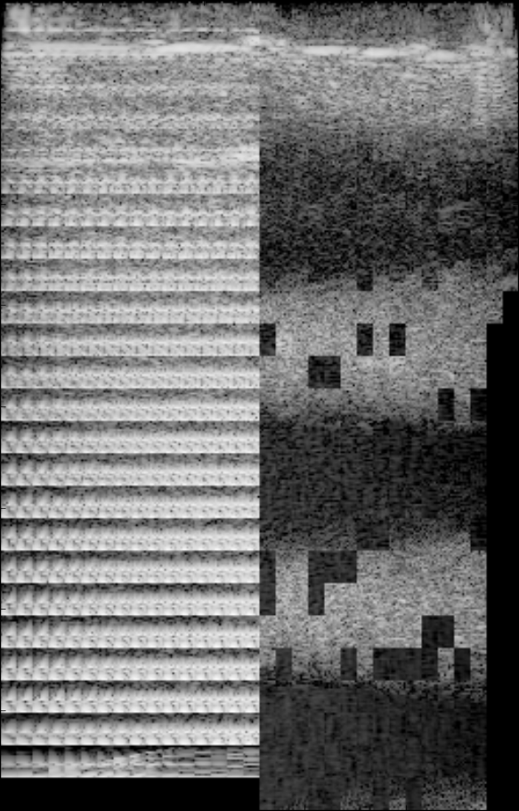

As a computer scientists working on image processing algorithms I know about the frustrating process of hunting bugs on massively-parallel architectures like GPUs. Sometimes those bugs can produce completely incorrect images or sequences of images but with a certain aesthetic appeal.

--excerpt--

The art world, with its superior ability to name things (compared to computer science), calls these accidents "Glitch Art"[^0].

I have long maintained a directory on my computer called _glitch_ - a place where I capture the moments when my frantic and frustrated debugging yields not the result that I am after but something else, something surprising or pleasant or something that represents my state of mind: confused chaos. Here are a few of my favorite captures from that directory:

 

<figure>
    
    <figcaption>
      <strong>Glitch 3</strong>: This shows magnitude and phase of what I seem to recall is a synthetic signal; for fun this is colorized with an art-deco inspired color scheme.
    </figcaption>
</figure>

 

<figure>
    
    <figcaption>
      <strong>Glitch 6</strong>: Extreme quantization of these 5 frames and stringing them together in an animation in quick succession makes this one look organic, like it is morphing, maybe into the correct answer? Unfortunately not.
    </figcaption>
</figure>

 

<table>
  <tr>
    <td style="width:50%">
      <figure>
      
      <figcaption>
      <strong>Glitch 4</strong>: A fun little ultrasound scanning beam with lots of glitching artifacts throughout and funky colors. This is my second favorite.
      </figcaption>
      </figure>
    </td>
    <td style="width:50%">
      <figure>
      
      <figcaption>
      <strong>Glitch 5</strong>: Wild confetti - I do not recall how this was created but it is likely a data-type misinterpretation (float32 vs rbga perhaps).
      </figcaption>
      </figure>
    </td>
  </tr>
</table>

 

<figure>
    
    <figcaption>
      <strong>Glitch 2</strong>: This is by far my favorite. It is the consequence of an Intel GPU driver bug. There is so much going wrong here - on the left you can see what seems to be an indexing error that gets more visible over time and on the right you see what could be a synchronization problem. You can see the blocks the problem is partitioned into and that some appear to be complete and some are not. Intel eventually fixed that bug.
    </figcaption>
</figure>

 

<figure>
    
    <figcaption>
      <strong>Glitch 7</strong>: This meant to be a smooth "laser-beam". Close, but no cigar: funky semi-random, semi-repeating patterns in the center of the "laser-beam" are disorienting
    </figcaption>
</figure>

I love how these glitch captures give a glimpse into what is going on behind the scenes of an image processing algorithm. If it works flawlessly one does not question all the various steps that make a final image but when things go wrong one can peek behind the curtain and start to get an idea of complexity of what computers do these days.

[^0]: Note that they do not always have to be accidents, oftentimes Glitch Art is created intentionally.

