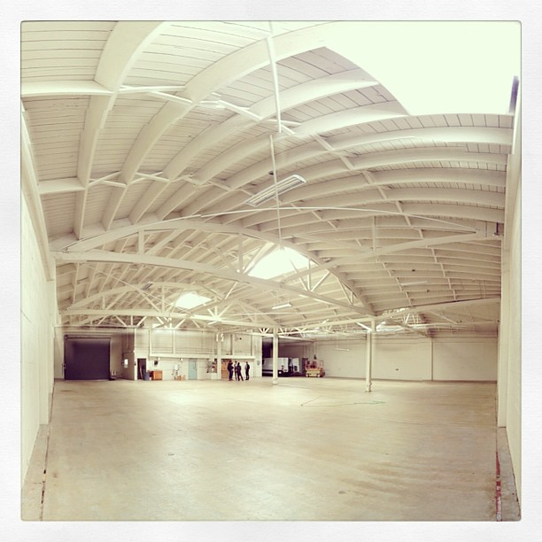
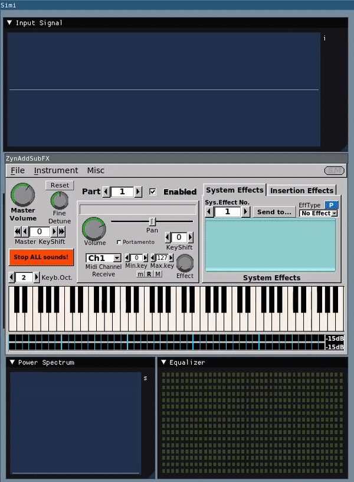

I recently quit my job at Butterfly Network and am now spending some
time writing code I am excited for, covering topics I want to
learn more about. It is an incredible feeling to start with a
blank source-code file. It can also be somewhat intimidating -
many decisions must be made. But in my case it was quite liberating
as I did not care about technical debt or making the perfect
decision. I am just tinkering.

--excerpt--

<figure>
    
    <figcaption>Now that's a beautiful blank slate by
<a href="https://www.flickr.com/photos/alon/8677798011/">alon</a>
    </figcaption>
</figure>

Combining my interest in signal processing, music and always wanting
to try out the [Dear ImGui](https://github.com/ocornut/imgui) graphical
user interface library for C++ I set out with a simple idea: grab
real-time audio from a microphone or some other input and showing some
signal information like the power spectrum in real time. Nothing
particularly useful other than allowing me to learn a bunch of new stuff.

It all starts with grabbing the audio signal using the [PortAudio](http://www.portaudio.com/) library with its

> very simple API for recording and/or playing sound using a simple
callback function or a blocking read/write interface.

PortAudio uses some simple concepts to describe the data it captures:
- **sample:** a value at a point in time from the continuous audio
  signal (this is of course a very [generic](https://en.wikipedia.org/wiki/Sampling_(signal_processing)) concept)
- **frame:** a frame is a set of samples that occur simultaneously;
  for a stereo stream, a frame is two samples
- **frames per buffer:** the number of frames passed to the stream
  callback function, or the preferred block
  granularity for a blocking read/write stream.

Choosing buffer sizes is an interesting exercise in trading off latency
and discontinuations that I have not investigated yet.

I created a simple data structure with a list of empty buffers and a list
of populated buffers and some way to consume, produce and return empty
buffers. The lovely [`scoped_lock`](https://en.cppreference.com/w/cpp/thread/scoped_lock)
protects the data structure from concurrent modifications.

Each buffer has a [window function](https://en.wikipedia.org/wiki/Window_function#Hann_and_Hamming_windows)
applied to it. Then my good old friend the [FFTW3](https://www.fftw.org/)
library is used to compute a 32-bit real-to-complex Fourier transform and
we compute the magnitude in dB with:

$$ mag_{dB} = 20 * \log_{10}\sqrt{re^2 + im^2}$$

The final step is to plot the the signal and the power-spectrum. The power
spectrum can be quantized and plotted in an aesthetically pleasing way. And
here is the result:

<figure>
    
    <figcaption>The final result using <a href="https://github.com/zynaddsubfx/zynaddsubfx">zynaddsubfx</a> to verify correctness of the signal processing code. Note that the Input Signal has a filter function applied ot it already.
    </figcaption>
</figure>

All the code can be found on GitHub: [https://github.com/sschaetz/simiolus/](https://github.com/sschaetz/simiolus/)