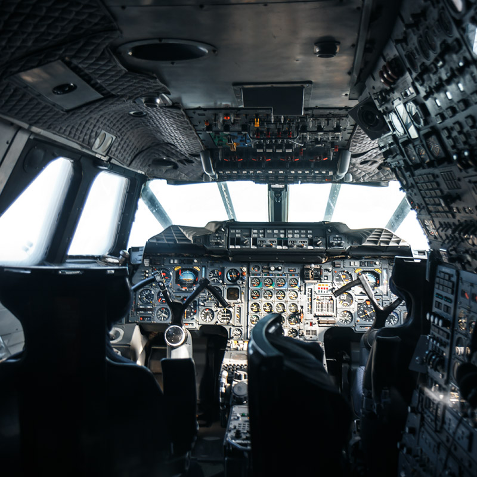
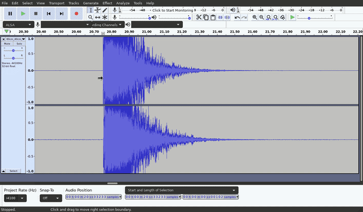

Inspired by an old but brilliant Clifford Stoll [video](https://www.ted.com/talks/clifford_stoll_the_call_to_learn/up-next?language=en)
and by my desire to get back into running experiments and reporting the results,
I recently set out to measure the speed of sound using a set of Roland CS-10EM binaural microphones
and a Zoom H2n I borrowed.

--excerpt--

<figure>
    
        <figcaption>Concorde, image by
        <a href="https://flickr.com/photos/32773922@N05/15773879464/">Tom Močička</a>
    </figcaption>
</figure>

In the experimental setup I place the 2 microphones 0.8 meters apart in a large room (6x6 meters), connect the microphone jack to the line-in port of the H2n and set it to 4 channel recording [^0]. After starting the recording I then position myself approximately 2 meters away from the 2 microphones along a straight line that connects myself and the two microphones. I smash two hardwood boards against each other to mimic an impulse signal as best I can.

My original plan was to load the waveforms for the 2 signals into Python and write code that detects the impulse and tries to overlap the signals to compute the offset and thus the speed of sound. It was easy to get started with [librosa](https://librosa.org/doc/latest/index.html) and I was delighted to discover that Python has a built-in [library to load WAV files](https://docs.python.org/3/library/wave.html). With numpy and matplotlib I was already familiar.

My various attempts to automatically match up the 2 waveforms failed, however. A reddit [post](https://www.reddit.com/r/DSP/comments/pdqngu/measure_speed_of_sound_question/) and the helpful answers to that post allowed me to eliminate a number of potential issues with my original experiment.

Instead I matched them up manually using [Audacity](https://www.audacityteam.org/). Here are the results:

<figure>
    
    <figcaption>
    0.8m corresponds to a time-of-flight difference of 102 samples which yields a speed of sound of 345.9 m/s (at a sampling rate of 44100 samples per second).
    </figcaption>
</figure>

[^0]: This is something I figured out only after I tried to match up
      a [Mid/Side](https://en.wikipedia.org/wiki/Microphone_practice#M/S_technique:_Mid/Side_stereophony) signal which did not work at all. The 4 channel settings yields both a XY recording as well as a MS recording. For this experiment I used the XY recording of the 4 channel setting.

