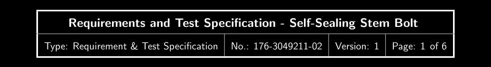
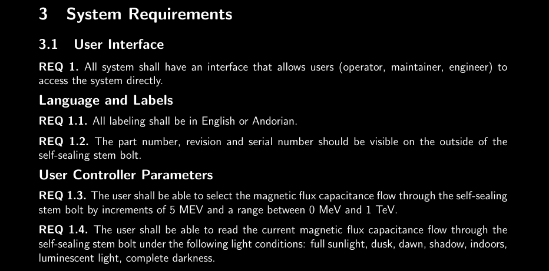
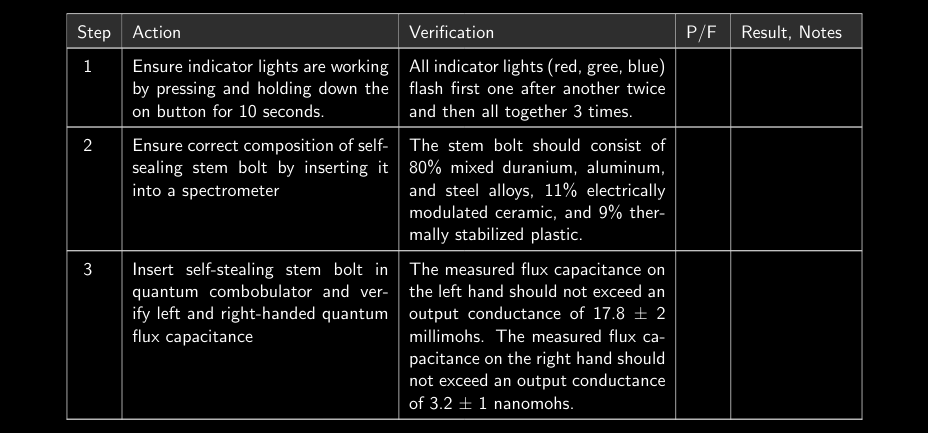

If you ever wrote software or designed hardware in a regulated industry,
it is very possible that you interfaced within a Quality Management System (QMS). I personally have seen a couple of different incarnations of such
a system: from paper-based with wet-ink signatures to fully database
driven and smart-card sign-off. Especially at smaller companies, paper-based
systems are common. Templates, checklist, manuals, SOPs and protocols are
created often as Word documents, are edited, sent, printed, signed, revised,
edited again, etc.

--excerpt--

<figure>
    
    <figcaption>Calibration, image by <a href="https://www.flickr.com/photos/fitzharris/12040967996">Brian Fitzharris
</a></figcaption>
</figure>

Creating, editing, updating and revising these documents can be cumbersome
and a time-suck. This is why I challenged myself to try to create a
[LaTeX](https://www.latex-project.org/)
document that could serve as an example and template for paper-based or QMS
documents.

I know LaTeX from my university and research days where I used it to author
a few papers, my thesis and a couple of presentations. LaTeX allows me to
write plain text (as opposed to formatted text) so it's hard to "mess up"
documents the way it occasionally happens with Word documents with many
authors and revisions. I also enjoy the high typographic quality of LaTeX
generated documents.

First off, I created a header - the header includes the title, document type, document number, document revision or version and the page number.



Next, I wanted to be able to be able to list and enumerate nested requirement lists. The following snippet sets up a `theorem` based environment with correct
enumeration.

```latex
\theoremstyle{definition}
\newtheorem{theorem}{REQ}
\newcount\savedtheorem
\newenvironment{subtheorems}{
  \savedtheorem=\value{theorem}
  \edef\prevthetheorem{\thetheorem}
  \setcounter{theorem}{0}
  \renewcommand\thetheorem{\prevthetheorem.\arabic{theorem}}
}
{
  \setcounter{theorem}{\savedtheorem}%
}
```

Here is an example of what that can look like: requirements can be nested and interspersed with chapters, sections and subsections. Requirements are
enumerated automatically document-wide.



Another goal was to be able to create test steps or checklists for verification
and validation test protocols. These are typically enumerated lists of test
steps a test operator os system should take with preconditions or
post-conditions or expected outcomes and a way for operators to record results
and additional notes. This can be seen here:



The entire example can be found at
[github.com/sschaetz/design-doc-tex](https://github.com/sschaetz/design-doc-tex)
and supports the following items including the ones already discussed:

- a logo at the top left
- a multi-row page-header with file title, version, number
- a footer with copyright information
- a way to list and enumerate requirements (with the theorem facility)
- a way to describe test steps with action, expected result, pass fail and
  additional notes (long table with header-row repeated)
- a form for authors, test operators, etc. to fill out and sign
- a document revision history

The full document can be found [here](https://github.com/sschaetz/design-doc-tex/blob/main/main.pdf). There are some obvious draw-backs - only very few people (compared the the Word userbase) are able and/or willing to edit LaTeX documents. But my hope is that this might be useful for other who struggle
with sending Word documents back and forth.
